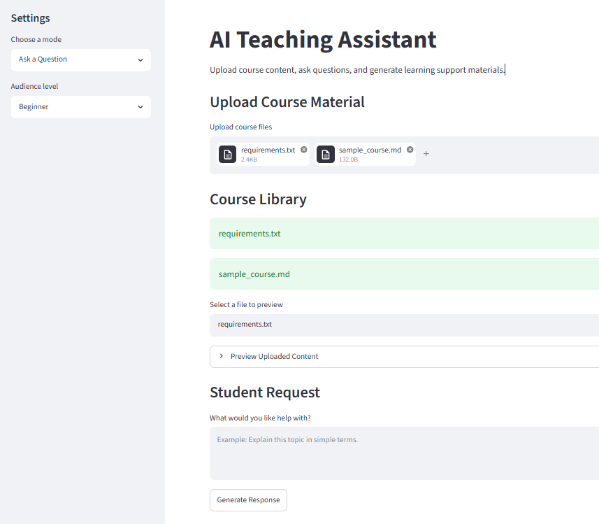

# AI Teaching Assistant

An AI-powered educational assistant that helps students learn from instructor-provided content.

## Current Features

- Multiple file upload
- Course library display
- Document preview
- Streamlit web interface

## Screenshot

## Technology Stack

- Python
- Streamlit

## Current Version

v0.1.0 (Pre-release)

## Roadmap

- Document chunking
- Vector database integration
- RAG pipeline
- AI-powered question answering
- Quiz generation
- Study guide generation